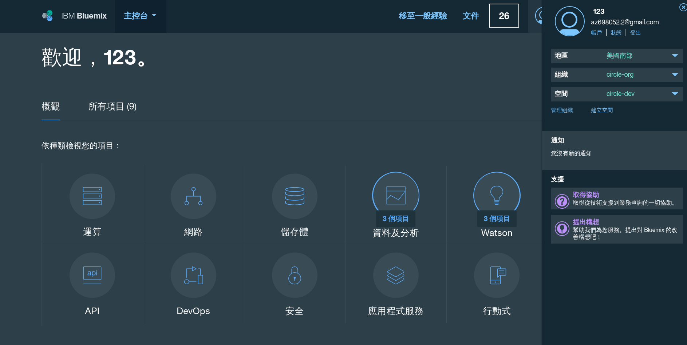

# This is a tutorial about how to build a dialog robot on 7688.


## 7688 setup


### Congigure the USB sound card.

```sh
opkg update
opkg install kmod-usb-audio
aplay -l
aplay -D plughw:1,0 <audio-file.wav>
```

Choose the USB sound card and tune the volume with alsamixer.

```sh
alsamixer
```

### Extend root file system to SD card.


List orginal space on-board flash.

```sh
df -h
```

Install the required packages.

```sh
opkg update
opkg install block-mount kmod-fs-ext4 kmod-usb-storage-extras e2fsprogs fdisk
```

Insert the SD card and format it to ext4 file system.

```sh
mkfs.ext4 /dev/mmcblk0
```

Duplicate the root file system to SD card.

```sh
mount /dev/mmcblk0 /mnt
tar -C /overlay -cvf - . | tar -C /mnt -xf -
umount /mnt
```

Congiure the fstab.

change the target option to '/overlay', and the enabled option to '1'.

```sh
block detect > /etc/config/fstab
vi /etc/config/fstab
```

Reboot and check the new space.

```sh
reboot
df -h
```

## Login in your Bluemix accout (see [Chap0](../chap0) for detail)

Remember to set your region to US South.

Now let us create a Bluemix Speech to Text service.



Click Watson and select Speech to Text service.


Save the credential to my-stt-credentials.json


## Deploy the app on 7688

First, download the app folder to 7688. Using scp or SD card is recommended.

Second, plug in USB sound card on 7688 USB port, and then connect microphone and speaker.

Finally, log in to 7688 and clone this repo,
and **replace the app/my-stt-credentials with your credentials**,
then launch the application in app folder.

```sh
git clone https://github.com/YuanYouYuan/Bluemix-tutorial.git
cd Bluemix-tutorial/7688/app
node app.js
```

## And here is a video demo run on my notebook with Arch linux system.

[](https://www.youtube.com/watch?v=Smp5kGfYSCE)

