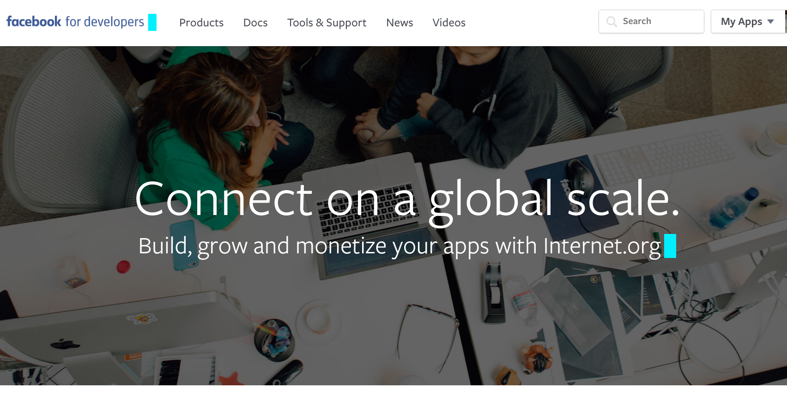
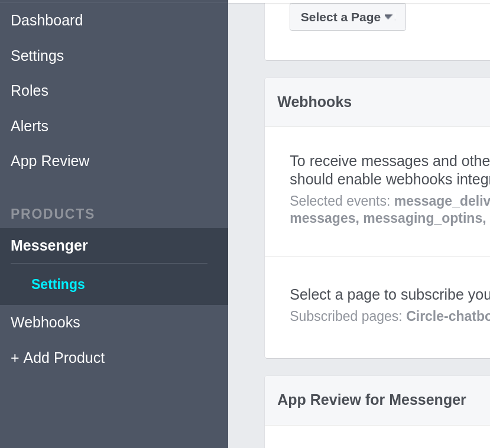
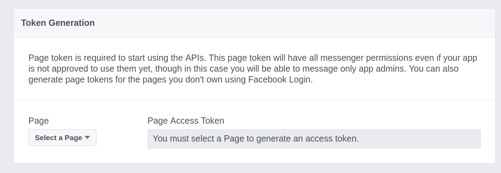
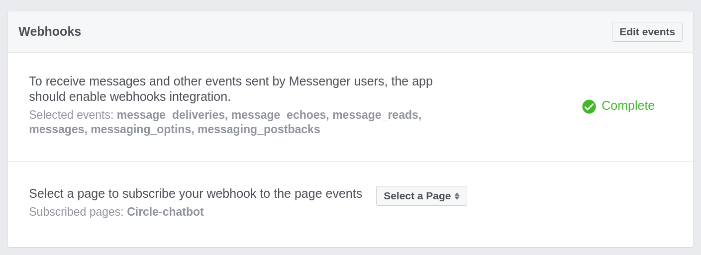
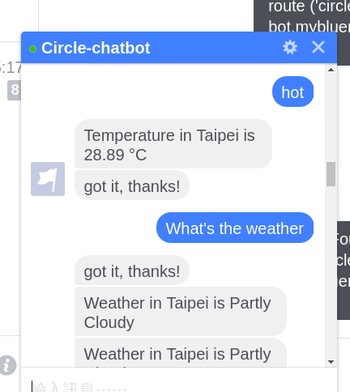

# Building Facebook chatbot with bluemix

## How does it work?

**Facebook Messager API** <-----> **Broker** <-----> **Weather Bot**

The broker app bind with Facebook API would receive the message if there is a text sent to your fanpage.
And the broker would deal with the message and make a request to the weather bot.
And then the weather bot would use Bluemix Natural Language Classifier to determine what kind of 
information does the user want. Finally the weather bot would make a request to Bluemix Weather Insights 
to get the weather data of the location and send it back to Facebook messager.
	
## Preparation

Please install the following tools you need.

For linux/mac os x users, it is recommended to install them by the package manager of your linux system.

For windows users, you can link to following sites and install them by instruction.

1. git https://git-scm.com/download/win

2. python https://www.python.org/ftp/python/3.6.0/python-3.6.0a3-amd64.exe

   please remember to add python to enviroment path while installing.

3. cloudfoundry-cli https://github.com/cloudfoundry/cli/releases


Also, you need to have a bluemix account, that's important.


## Broker Setup

Please open your terminal/windows command line and type the following command.

```sh
git clone https://github.com/YuanYouYuan/Bluemix-tutorial.git
```

And then change directory to Bluemix-tutorial/facebook-weather-bot/broker.

Edit the manifest.yml, chanage the name and host to whatever you like.

Notice that the name you choosed must be unique because the server would be work on the internet,

```yaml
applications:
- path: .
  memory: 256M
  instances: 1
  domain: mybluemix.net
  name: yourname-broker
  host: yourname-broker
  disk_quota: 1024M
```


Create a facebook fanpage if you don't have one, 
and then visit the facebook for developers website and create a app.

https://developers.facebook.com/apps/



Click 'Add Product' -> 'Messenger'.



__Token Generation__

Choose your fanpage at Select a Page, and copy the page access token.
Edit the app.js and replace the var token.



```javascript
var token = "pasteYourAccessTokenHere";
var host = (process.env.VCAP_APP_HOST || 'localhost');
var port = (process.env.VCAP_APP_PORT || 3000);
app.listen(port, host);
```

And remember to run the following python code to set the access token.

```sh
python set_fb_access_token.py "PasteYourAccessTokenHere"
```

Now we can use cloudfoundry-cli to deploy this app.

```sh
cf login -a https://api.ng.bluemix.net
cf push
```

If you can't login by cf, make sure you have set the organization and space correctly, 
note that the locale must be set to  US South.

And if the Bluemix UI don't automatically guide you to set it when you first log in,
try to create a new CloudFoundry on Bluemix website UI, 
and choose any SDK since you don't really use it, 
this process would invoke the guide.

After the broker app successfully running at cloud, 
we should set webhook in Facebook developer webpage.

__Setup the Webhooks__



* Callback URL: fill in your broker url (e.g. https://yourname-broker.mybluemix.net/ )
* Verification Token: fb_weather_bot_verify_token
* Subscription Fields: messages, messaging_options, messaging_postbacks, message_reads, message_delivers

and remember to select your fanpage to subscribe your webhook to page events.


## Weather Bot Setup

Create the Bluemix necessary services.

```sh
cf create-service natural_language_classifier standard yourname-weather-bot-NLC 
cf create-service weatherinsights Free-v2 yourname-weather-bot-WI
```

And edit the Bluemix/facebook-weather-bot/weather-bot/manifest.yml, then fill in your name.

```yaml
applications:
- path: .
  memory: 256M
  instances: 1
  domain: mybluemix.net
  name: yourname-weather-bot
  host: yourname-weather-bot
  disk_quota: 1024M
  services:
  - yourname-weather-bot-NLC
  - yourname-weather-bot-WI
```


Push it with cf, it would create a weather-bot app on your Bluemix, 
and bind the service you created to this app.

```sh
cf push
```

Now you can obeserve the status of your app, please check wether the two apps broker and weathor-bot are
working normally.

```sh
cf apps
cf logs yourname-weather-bot --recent
cf logs yourname-borker --recent
```


## Train the Natural Language Classifier

First we need to get the credential key of your service. 

We can view this by the environment variable in weather-bot app.

```sh
cf env yourname-weather-bot
```

Copy the credential of natural language service and save it as new file credential.json in 
Bluemix-tutorial/facebook-weather-bot/weather-bot/NLC.

For example credential.json.

```json
{
 "password": "PLX7Ua3YeZaK",
 "url": "https://gateway.watsonplatform.net/natural-language-classifier/api",
 "username": "c918a7f7-6f5e-4f7a-8426-4c2080645cca"
}
```

Upload the training file weather_data_train.csv to Bluemix and create a classifier.

Since we use python to do this task, so we need to install some packages before creating the classifier.
Install pandoc from the following link.

https://github.com/jgm/pandoc/releases/download/1.17.2/pandoc-1.17.2-windows.msi

Install watson_developer_cloud API for python.

```sh
pip install watson_developer_cloud
```

Adn it may take some time to create a new classifer (training may take 10 minutes).

```sh
python NLC_create.py
```

You can check the status by running the NLC_status.py.

```sh
python NLC_status.py
```
And after the trainging finished, you can check wether the NLC is working by running NLC_test.py.

```sh
python NLC_test.py
```

Now push again to update the new app to Bluemix.

```sh
cf push
```

## Usage

Log in your facebook and try to chat with weather-bot!




## Troubleshooting

* If you get 404 error, it may be caused by your weather-bot app is died, just restart it.

```
cf restart yourname-weather-bot
```
## Reference

https://developer.ibm.com/bluemix/2016/05/26/bot-for-facebook-messenger-using-bluemix/


